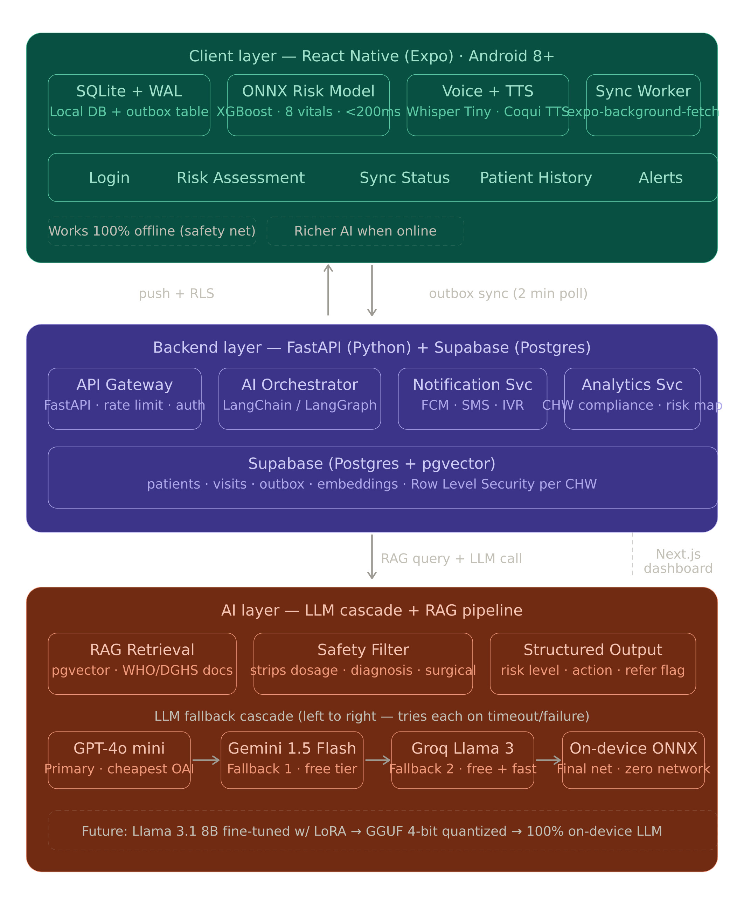
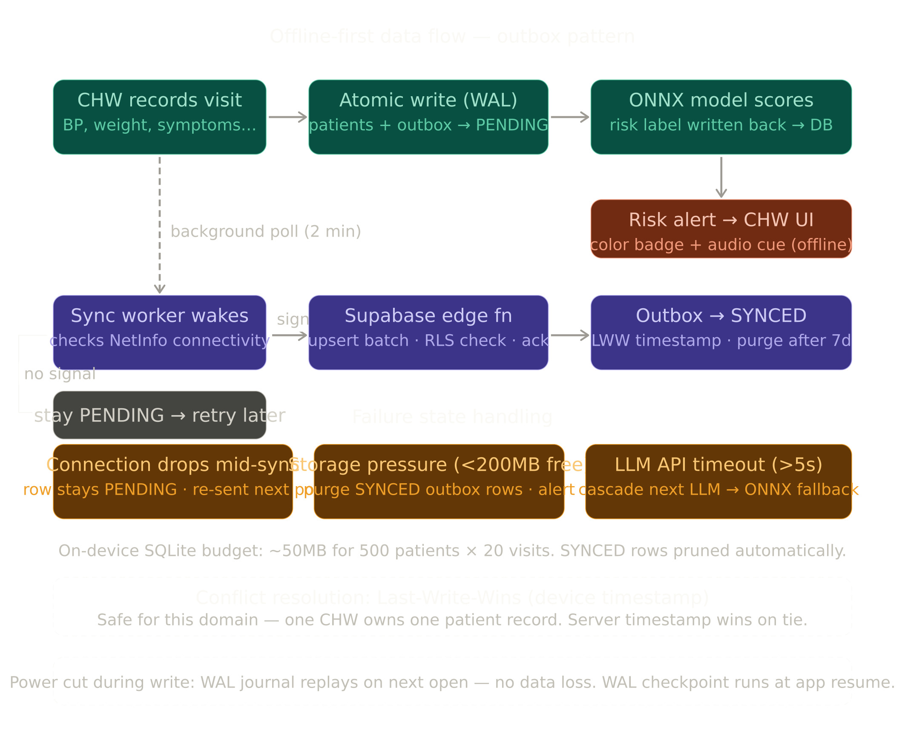

<div align="center">

# 🤰 Masheba AI

### *মা-সেবা — Every Mother Deserves a Safety Net*

**An offline-first, AI-powered maternal health assistant built for the realities of rural Bangladesh**

[](https://expo.dev)
[](https://fastapi.tiangolo.com)
[](https://supabase.com)
[](https://nextjs.org)
[](LICENSE)

<br />

> **🏆 Built for The Infinity AI BuildFest 2026 by Team DareDevil**

</div>

---

## 📋 Table of Contents

- [The Problem](#-the-problem)
- [Our Solution](#-our-solution)
- [System Architecture & Engineering Specifications](#-system-architecture--engineering-specifications)
  - [1. Design Philosophy](#1-design-philosophy)
  - [2. System Overview](#2-system-overview)
  - [3. Client Layer — Mobile Application](#3-client-layer--mobile-application)
  - [4. Backend Layer — API & Data Services](#4-backend-layer--api--data-services)
  - [5. AI Layer — Intelligence Pipeline](#5-ai-layer--intelligence-pipeline)
  - [6. Data Architecture](#6-data-architecture)
  - [7. Sync Architecture — Offline-First Design](#7-sync-architecture--offline-first-design)
  - [8. Security Architecture](#8-security-architecture)
  - [9. Deployment Architecture](#9-deployment-architecture)
  - [10. Observability & Monitoring](#10-observability--monitoring)
  - [11. Scalability Considerations](#11-scalability-considerations)
  - [12. Failure Modes & Recovery](#12-failure-modes--recovery)
  - [13. Future Architecture — On-Device LLM](#13-future-architecture--on-device-llm)
  - [Appendix A: Key Design Decisions Log](#appendix-a-key-design-decisions-log)
- [Project Structure](#-project-structure)
- [Key Features](#-key-features)
- [Getting Started](#-getting-started)
- [API Reference](#-api-reference)
- [Database Schema](#-database-schema)
- [Testing](#-testing)
- [Deployment](#-deployment)
- [Future Roadmap](#-future-roadmap)
- [Team](#-team)
- [License](#-license)

---

## 🩺 The Problem

**Bangladesh has one of the highest maternal mortality rates in South Asia.** In rural areas, the situation is critical:

| Challenge | Reality |
|-----------|---------|
| 🌐 **Network** | Grameenphone 3G drops every 10–15 min; hours with no signal |
| 📱 **Devices** | ৳6,000–12,000 Android phones (2GB RAM, 16GB storage) |
| ⚡ **Power** | Load shedding keeps batteries at ~30% |
| 📝 **Literacy** | Semi-literate users — typing is hard, voice is natural |
| 🏃 **Workload** | CHWs visit 15–20 patients daily on foot — need one-tap actions |
| 🚨 **Emergencies** | Eclampsia and hemorrhage leave zero time for loading screens |

Community Health Workers (CHWs) serve as the primary touchpoint for pregnant women, yet they lack real-time clinical decision support, especially in areas with poor connectivity.

---

## 💡 Our Solution

**Masheba AI** is an offline-first mobile application that puts a clinical safety net directly in the hands of Community Health Workers. It works when the network doesn't.

```
┌─────────────────────────────────────────────────────────────┐
│                    Elevator Pitch                            │
│                                                             │
│  "An AI-powered maternal health app that logs visits        │
│   locally with zero internet, syncs seamlessly when        │
│   online, and runs a clinical safety net right on-device    │
│   to ensure no mother falls through."                       │
└─────────────────────────────────────────────────────────────┘
```

### What Makes Masheba Different

- **🔌 Works offline first** — Core database operations (SQLite) run locally, ensuring zero data loss during power or network cuts.
- **🤖 Cloud-Based LLM Cascade** — When online, the app accesses advanced AI chat (Groq/Gemini cascade) hosted on Render.
- **🌐 Online Fully Enabled** — If connected, the app provides clinical decision-making support and synchronization. For the social worker, internet connectivity is mandatory for Clinical AI support.
- **🛡️ Safety-filtered responses** — No drug dosages or diagnoses; always refers to upazila hospitals.
- **📊 Admin visibility** — Real-time dashboard for upazila health officers to check patient risk distributions.
- **🗣️ Voice-ready** — Bangla speech input when online for semi-literate users.
- **🔒 Privacy by design** — Row Level Security ensures CHWs see only their patients.

---

## 🏗️ System Architecture & Engineering Specifications

This section details the production-grade engineering design of Masheba AI.

### 1. Design Philosophy

Masheba's architecture is built around **six non-negotiable constraints** derived from the realities of rural Bangladesh:

| Constraint | Design Response |
|------------|----------------|
| Network drops every 10-15 min on 3G | **Offline-first** — all core database features work without internet |
| ৳6,000-12,000 Android phones (2GB RAM) | **Rule-based offline safety checks** — fallback logic runs on-device |
| Load shedding keeps battery at ~30% | **WAL journaling** — survives power cuts mid-write |
| Semi-literate users | **Voice input** — Bangla speech-to-text (when online) |
| CHWs visit 15-20 patients on foot | **One-tap actions** — no multi-step forms or loading screens |
| Emergencies need instant response | **Deterministic offline safety rules** — <200ms, zero network latency |

#### Architectural Principles

1. **Offline-first, online-enhanced** — The app must never be blocked by network availability for core data entry.
2. **Graceful degradation** — Every feature has a fallback path, down to fully offline deterministic safety rules.
3. **Safety over accuracy** — Deterministic safety rules always override ML predictions when they detect danger.
4. **Privacy by default** — Row Level Security (RLS) enforces data isolation at the database level.
5. **Idempotent everything** — Sync operations use idempotency keys to prevent duplicates on retry.
6. **Medical responsibility** — No drug dosages, no diagnoses, always refer to human healthcare providers.

---

### 2. System Overview

<div align="center">

#### Overall System Architecture


<br />

#### Offline-First Data Flow (Outbox Pattern)


</div>

```
┌─────────────────────────────────────────────────────────────────────────┐
│                         SYSTEM BOUNDARY                                │
│                                                                        │
│  ┌─────────────────────────────────────────────┐                       │
│  │          CLIENT LAYER                       │                       │
│  │    React Native (Expo) · Android 8+         │                       │
│  │                                             │                       │
│  │  ┌────────┐ ┌───────┐ ┌──────┐ ┌────────┐  │                       │
│  │  │SQLite  │ │Rule-  │ │Voice │ │ Sync   │  │                       │
│  │  │+ WAL   │ │based  │ │STT/  │ │Worker  │  │                       │
│  │  │outbox  │ │safety │ │TTS   │ │2min bg │  │                       │
│  │  └────────┘ └───────┘ └──────┘ └───┬────┘  │                       │
│  └────────────────────────────────────┬┘───────┘                       │
│                                       │                                │
│                          outbox sync (HTTPS batch)                     │
│                                       │                                │
│  ┌────────────────────────────────────▼────────────────────────┐       │
│  │          BACKEND LAYER                                     │       │
│  │    FastAPI (Python 3.11+) + Supabase (Postgres 15)         │       │
│  │                                                            │       │
│  │  ┌──────────┐ ┌────────────┐ ┌──────────┐ ┌────────────┐  │       │
│  │  │API       │ │AI          │ │Notif     │ │Analytics   │  │       │
│  │  │Gateway   │ │Orchestrator│ │Service   │ │Service     │  │       │
│  │  │auth+rate │ │LangChain   │ │FCM/SMS   │ │compliance  │  │       │
│  │  └──────────┘ └─────┬──────┘ └──────────┘ └────────────┘  │       │
│  │                     │                                      │       │
│  │  ┌──────────────────▼──────────────────────────────────┐   │       │
│  │  │  Supabase Postgres                                  │   │       │
│  │  │  patients · visits · outbox_events · chws           │   │       │
│  │  │  pgvector embeddings · RLS per CHW                  │   │       │
│  │  └──────────────────┬──────────────────────────────────┘   │       │
│  └─────────────────────┼──────────────────────────────────────┘       │
│                        │                                              │
│                   RAG query + LLM cascade                             │
│                        │                                              │
│  ┌─────────────────────▼──────────────────────────────────────┐       │
│  │          AI LAYER                                         │       │
│  │                                                           │       │
│  │  ┌──────────┐ ┌──────────┐ ┌────────────────────────────┐ │       │
│  │  │RAG       │ │Safety    │ │LLM Cascade                 │ │       │
│  │  │Retrieval │ │Filter    │ │Groq → Gemini → Rules       │ │       │
│  │  │pgvector  │ │medical   │ │                            │ │       │
│  │  │WHO/DGHS  │ │guardrail │ │Future: On-device Llama 3.1 │ │       │
│  │  └──────────┘ └──────────┘ └────────────────────────────┘ │       │
│  └───────────────────────────────────────────────────────────┘       │
│                                                                       │
│  ┌───────────────────────────────────────────────────────────┐       │
│  │  ADMIN LAYER — Next.js 14 (Vercel)                       │       │
│  │  Dashboard · CHW list · Risk summary chart · Heat maps    │       │
│  └───────────────────────────────────────────────────────────┘       │
│                                                                       │
└─────────────────────────────────────────────────────────────────────────┘
```

---

### 3. Client Layer — Mobile Application

#### 3.1 Technology Stack

| Component | Technology | Rationale |
|-----------|-----------|-----------|
| Framework | React Native (Expo) | JS ecosystem alignment with backend; Expo Go for testing on cheap devices |
| Navigation | Expo Router + React Navigation | File-based routing, bottom tabs |
| Local DB | `expo-sqlite` with WAL mode | Atomic writes survive power cuts; WAL allows concurrent read/write |
| Safety Rules | Client-side logic | Deterministic offline safety rule checks in <200ms |
| Sync | `expo-background-task` | 2-minute background polling for outbox flush |
| Auth | `expo-secure-store` | JWT storage in device keychain |
| Notifications | `expo-notifications` | Push notification support |
| Animations | `react-native-reanimated` | Smooth UI transitions on low-end devices |

#### 3.2 Screen Architecture

```
app/
├── (auth)/
│   └── login                         # Supabase auth login
├── (chw)/                            # CHW-scoped screens
│   ├── dashboard                     # Patient list + risk overview
│   ├── visit/[patientId]            # Record visit vitals
│   ├── chat                         # Clinical AI chat (Requires Internet)
│   ├── medicine-verify              # Drug safety checker
│   └── profile                      # CHW profile + sync status
├── (mother)/                         # Mother-facing screens
│   ├── dashboard                     # Pregnancy tracker
│   └── qa                           # Q&A chat interface (Offline predefined fallback)
└── _layout                          # Root layout with tab navigation
```

#### 3.3 On-Device Database Schema (SQLite)

```sql
PRAGMA journal_mode = WAL;    -- Crash-safe writes
PRAGMA foreign_keys = ON;     -- Referential integrity

patients (
  id TEXT PRIMARY KEY,
  chw_id TEXT NOT NULL,
  name TEXT NOT NULL,
  age INTEGER CHECK (10-60),
  gestational_age_weeks INTEGER CHECK (1-45),
  last_risk_level TEXT CHECK ('LOW','MODERATE','HIGH'),
  created_at TEXT, updated_at TEXT
);

visits (
  id TEXT PRIMARY KEY,
  patient_id TEXT REFERENCES patients(id),
  chw_id TEXT, bp_systolic INTEGER CHECK (60-260),
  bp_diastolic INTEGER CHECK (30-180),
  weight_kg REAL CHECK (25-200),
  hemoglobin REAL CHECK (3-20),
  swelling_present INTEGER, symptom_flags TEXT,
  risk_level TEXT, visited_at TEXT, device_id TEXT
);

outbox_events (
  idempotency_key TEXT PRIMARY KEY,
  chw_id TEXT, device_id TEXT,
  event_type TEXT CHECK ('patient_upsert','visit_create'),
  payload TEXT, status TEXT DEFAULT 'PENDING',
  error_message TEXT, created_at TEXT, synced_at TEXT
);

offline_qa (
  id TEXT PRIMARY KEY,
  trimester TEXT CHECK ('T1','T2','T3','POSTPARTUM','ALL'),
  topic TEXT, question_bn TEXT, answer_bn TEXT,
  severity TEXT, see_doctor INTEGER, emergency INTEGER
);
```

#### 3.4 Client-Side Safety Rules & Offline Scoring

Due to mobile device resource constraints and the requirement for offline-first stability, advanced ML models (like the LLM cascade) run in the cloud (hosted on Render) and are queried when online. The mobile application relies on a deterministic rule-based safety path for instant offline risk assessment.

1. **Deterministic Safety Rules:** Checks for critical conditions:
   - Systolic BP ≥ 140 or Diastolic BP ≥ 90 mmHg → HIGH RISK
   - Hemoglobin < 8 g/dL → HIGH RISK (Severe Anemia)
   - Danger signs reported (blurred vision, severe headache) → HIGH RISK
   - Edema/Swelling present along with elevated BP (Systolic ≥ 130 or Diastolic ≥ 85) → HIGH RISK

2. **Moderate Risk Indicators:**
   - Borderline vitals (Systolic BP ≥ 130, Diastolic BP ≥ 85, Hemoglobin < 10)
   - Severe swelling present
   - Late gestational age (> 36 weeks)

3. **Offline Fallback Scoring:**
   - Vitals are scored instantly (<200ms) on-device without internet.
   - If `onnxruntime-react-native` fails or is not supported natively, the client gracefully falls back to deterministic rule scoring and mock risk functions, ensuring a consistent safety net.

---

### 4. Backend Layer — API & Data Services

#### 4.1 FastAPI Service Architecture

```
app/
├── main.py                    # FastAPI app + router registration
├── core/
│   └── config.py              # Pydantic Settings (env vars)
├── routers/
│   ├── health.py              # GET /health — liveness + Supabase check
│   ├── sync.py                # POST /sync — outbox batch processing
│   └── chat.py                # POST /chat — AI Q&A endpoint
├── services/
│   ├── supabase_client.py     # Supabase admin + user clients
│   └── chat_service.py        # LLM cascade + safety filters
└── models/                    # Pydantic request/response schemas
```

#### 4.2 API Endpoints

| Method | Path | Auth | Purpose |
|--------|------|------|---------|
| `GET` | `/health` | None | Service liveness + Supabase reachability |
| `POST` | `/sync` | Bearer JWT | Process 1-100 outbox events |
| `POST` | `/chat` | None | Bangla maternal health Q&A |

#### 4.3 Sync Gateway Flow

```
Mobile App                    FastAPI                    Supabase
    │                           │                          │
    │  POST /sync               │                          │
    │  {events: [...]}          │                          │
    │  Bearer: <CHW JWT>        │                          │
    │─────────────────────────►│                          │
    │                           │  Validate JWT            │
    │                           │  Check chw_id match      │
    │                           │                          │
    │                           │  RPC: process_outbox_    │
    │                           │  batch(events)           │
    │                           │─────────────────────────►│
    │                           │                          │
    │                           │  For each event:         │
    │                           │  - Check idempotency     │
    │                           │  - Upsert patient/visit  │
    │                           │  - Write outbox_events   │
    │                           │  - RLS enforcement       │
    │                           │◄─────────────────────────│
    │                           │                          │
    │  {results: [...],         │                          │
    │   synced_at: "..."}       │                          │
    │◄─────────────────────────│                          │
```

---

### 5. AI Layer — Intelligence Pipeline

#### 5.1 Chat Service Architecture

The chat service implements a **cascading LLM fallback** pattern deployed on the Render web server:

```
Request ──────────────────────────────────────────────────────►
    │
    ├─► [1] Groq API (Llama 3.1 8B Instant)
    │       ├─ Timeout: 30s
    │       ├─ Max tokens: 300
    │       ├─ Temperature: 0.3
    │       └─ ✅ Success → validate → return
    │       └─ ❌ Fail → cascade
    │
    ├─► [2] Gemini API (Flash 1.5 → 2.5)
    │       ├─ Model iteration: tries 1.5 first, 2.5 on 404
    │       ├─ Thinking disabled for 2.5 (thinkingBudget: 0)
    │       └─ ✅ Success → validate → return
    │       └─ ❌ Fail → cascade
    │
    └─► [3] Offline Fallback
            "এই মুহূর্তে সংযোগ সমস্যা হচ্ছে।
             অফলাইন তথ্য ব্যবহার করুন।"
```

#### 5.2 Role-Based Internet Dependencies

Connectivity dictates how the app acts for different user classes:

- **Mothers:** Designed to degrade gracefully.
  - **Online:** Mothers can chat with the live AI assistant using natural language.
  - **Offline:** Live LLM chat is replaced by a structured offline Q&A module. Mothers choose from categorized health questions, and the app retrieves pre-seeded, trusted answers from the local SQLite `offline_qa` table.
- **Social Workers (CHWs):** Internet is **mandatory** for Clinical AI chat support.
  - Since CHWs operate in city, municipal, or upazila areas where internet networks are accessible, they require a stable internet connection for the clinical AI assistant.
  - If a CHW goes offline, a banner warns: *"Clinical AI requires internet connection."* (ক্লিনিক্যাল AI-এর জন্য ইন্টারনেট সংযোগ প্রয়োজন). The input fields are disabled to prevent inaccurate guidance. However, their offline patient records and visit forms are saved locally and synced once connection is restored.

#### 5.3 System Prompt (Bangla)

The system prompt enforces strict behavioral constraints on the LLMs:

- **Language:** Bangla only
- **Scope:** Pregnancy, childbirth, maternal health, newborn care only
- **Prohibited:** Drug dosages, specific diagnoses
- **Emergency protocol:** Severe symptoms → "এখনই হাসপাতালে যান" (Go to hospital now)
- **Tone:** Warm, empathetic, 2-3 sentences max

#### 5.4 Safety Filter Pipeline

```
LLM Response
    │
    ├─► [1] Bangla Character Check ([\u0980-\u09FF] regex)
    │       Reject if no Bangla characters present
    │
    ├─► [2] Sentence Normalization
    │       Cap at 3 sentences for readability
    │
    ├─► [3] Hallucination Detection
    │       Reject: "আমি বুঝতে পারলাম না", "IUD", "json requested"
    │
    ├─► [4] Emergency Keyword Scan
    │       রক্তপাত, খিঁচুনি, মাথাব্যথা, ঝাপসা, নড়াচড়া বন্ধ...
    │       If detected + response lacks "হাসপাতাল" → append referral
    │
    ├─► [5] Emergency Consistency
    │       If emergency but response mentions "চা" or "কফি" → reject
    │
    └─► [6] Safety Disclaimer
            Always append: "⚠️ এটি শুধু তথ্য। গুরুতর সমস্যায়
            সবসময় স্বাস্থ্যকর্মী বা হাসপাতালে যান।"
```

#### 5.5 RAG Pipeline (Future)

```
Query: "32 weeks pregnant, BP 150/100, severe headache"
    │
    ├─► Embed query (text-embedding-3-small)
    │
    ├─► pgvector similarity search
    │   └─ Top 3 chunks from WHO/DGHS guidelines
    │
    ├─► Assemble structured prompt
    │   └─ System prompt + retrieved context + query
    │
    └─► LLM generates response
        └─ Structured: risk_level, action, referral_flag
```

---

### 6. Data Architecture

#### 6.1 Data Sources

| Source | Type | Purpose |
|--------|------|---------|
| `csafrit2/maternal-health-risk-data` | Kaggle | BP-centered XGBoost training data |
| `ankurray00/maternal-health-and-high-risk-pregnancy-dataset` | Kaggle | Weight, gestational age, anemia features |
| WHO Antenatal Care Guidelines | Document | RAG embedding context |
| Bangladesh DGHS Maternal Health Protocols | Document | RAG embedding context |
| Offline Q&A Seed Data | Internal | Pre-built Bangla Q&A pairs by trimester |

#### 6.2 Data Flow

```
                           ┌───────────────┐
                           │  Data Sources  │
                           │  Kaggle, WHO,  │
                           │  DGHS, Offline │
                           └───────┬───────┘
                                   │
                    ┌──────────────┼──────────────┐
                    │              │              │
                    ▼              ▼              ▼
            ┌──────────┐  ┌──────────┐  ┌──────────────┐
            │ XGBoost  │  │ pgvector │  │ SQLite Seed  │
            │ Training │  │ Embed    │  │ (Offline QA) │
            │ Pipeline │  │ Pipeline │  │              │
            └────┬─────┘  └────┬─────┘  └──────┬───────┘
                 │              │               │
                 ▼              ▼               ▼
            ┌──────────┐  ┌──────────┐  ┌──────────────────┐
            │  Safety  │  │ Supabase │  │ Mobile App       │
            │  Rules   │  │ Postgres │  │ offline_qa table │
            │(Offline) │  │ vectors  │  │ seeded at init   │
            └──────────┘  └──────────┘  └──────────────────┘
```

#### 6.3 Storage Architecture

| Store | Engine | Contents | Scope |
|-------|--------|----------|-------|
| **Device SQLite** | expo-sqlite + WAL | patients, visits, outbox, offline_qa, sync_state | Per-device |
| **Supabase Postgres** | PostgreSQL 15 | chws, patients, visits, outbox_events, mothers, chat | Cloud (RLS-scoped) |
| **pgvector** | Supabase extension | WHO/DGHS guideline embeddings | Cloud (shared) |
| **Safety Rules** | Client-side JavaScript | Deterministic safety rule logic | Bundled in App code |

---

### 7. Sync Architecture — Offline-First Design

#### 7.1 The Outbox Pattern

The outbox pattern is the **cornerstone** of Masheba's offline capability. Every write operation on the mobile device follows this sequence:

```
1. CHW records patient visit
2. Atomic SQLite transaction (WAL mode):
   a. INSERT/UPDATE patients table
   b. INSERT visits table
   c. INSERT outbox_events (status: PENDING)
3. Rule-based risk scoring runs on-device
4. Risk level written back to patients.last_risk_level
5. UI shows risk badge immediately (no network needed)
```

#### 7.2 Background Sync Worker

```typescript
// Runs every 2 minutes via expo-background-task
async function runOutboxSync() {
  // 1. Check network connectivity
  if (!network.isConnected) return { skipped: true };

  // 2. Check auth session
  if (!session) return { skipped: true };

  // 3. Read PENDING outbox events (max 100)
  const pending = await getPendingOutbox(100);
  if (pending.length === 0) return { processed: 0 };

  // 4. POST to /sync endpoint
  const response = await postSync(pending, session.accessToken);

  // 5. Apply results (SYNCED/DUPLICATE/FAILED)
  await applySyncResults(response.results, response.synced_at);

  // 6. Update last_synced_at
  await setLastSyncedAt(response.synced_at);
}
```

#### 7.3 Conflict Resolution Strategy

| Scenario | Resolution |
|----------|-----------|
| Same patient updated by same CHW | Last-Write-Wins (device timestamp) |
| Duplicate sync attempt | Idempotency key returns DUPLICATE — no duplicate data |
| Connection drops mid-sync | Row stays PENDING — re-sent on next poll |
| Storage pressure (<200MB free) | Purge SYNCED outbox rows + alert user |
| LLM API timeout (>5s) | Cascade to next LLM → safety rules fallback |

#### 7.4 Idempotency

Every outbox event has a unique `idempotency_key` generated on the device:

```
Format: {device_id}-{event_type}-{uuid_v4}
Example: device-a-visit-001
```

The Supabase `process_outbox_batch` RPC:
- Checks if `idempotency_key` already exists in `outbox_events`
- If exists → returns `DUPLICATE` (no data written)
- If new → writes patient/visit + outbox row → returns `SYNCED`

---

### 8. Security Architecture

#### 8.1 Authentication Flow

```
Mobile App                    Supabase Auth                   Postgres
    │                              │                              │
    │  Email/Password Login        │                              │
    │─────────────────────────────►│                              │
    │                              │                              │
    │  JWT (access_token)          │                              │
    │◄─────────────────────────────│                              │
    │                              │                              │
    │  Store in expo-secure-store  │                              │
    │  (device keychain)           │                              │
    │                              │                              │
    │  POST /sync                  │                              │
    │  Bearer: <JWT>               │                              │
    │─────────────────────────────►│                              │
    │                              │  JWT → current_chw_id()      │
    │                              │─────────────────────────────►│
    │                              │                              │
    │                              │  RLS enforces:               │
    │                              │  chw_id = current_chw_id()   │
    │                              │◄─────────────────────────────│
```

#### 8.2 Row Level Security (RLS)

| Table | SELECT | INSERT | UPDATE | DELETE |
|-------|--------|--------|--------|--------|
| `chws` | Own row only | ✗ | Own row only | ✗ |
| `patients` | Own patients | Own patients | Own patients | ✗ |
| `visits` | Own visits | Own visits | ✗ | ✗ |
| `outbox_events` | ✗ | Own events | ✗ | ✗ |

#### 8.3 Medical Safety Controls

| Control | Implementation |
|---------|---------------|
| No drug dosage recommendations | System prompt + response filter |
| No definitive diagnoses | System prompt + response filter |
| Emergency referral injection | Auto-append "Go to hospital" for critical keywords |
| Bangla-only responses | Regex validation: `[\u0980-\u09FF]` must be present |
| Response length limit | Max 3 sentences to prevent information overload |
| Safety disclaimer | Always appended to non-emergency responses |

---

### 9. Deployment Architecture

```
┌─────────────────────────────────────────────────────┐
│                  PRODUCTION                          │
│                                                     │
│  ┌──────────┐    ┌──────────┐    ┌──────────────┐  │
│  │ Vercel   │    │ Railway/ │    │ Supabase     │  │
│  │          │    │ Render   │    │ Cloud        │  │
│  │ Admin    │    │          │    │              │  │
│  │ Next.js  │    │ FastAPI  │    │ Postgres 15  │  │
│  │ SSR      │    │ Backend  │    │ pgvector     │  │
│  │          │    │          │    │ Edge Fns     │  │
│  │ Free     │    │ Free/$5  │    │ Auth         │  │
│  └──────────┘    └──────────┘    │ RLS          │  │
│                                  └──────────────┘  │
│                                                     │
│  ┌──────────────────────────────────────────────┐  │
│  │        Mobile Clients (Expo)                 │  │
│  │  Expo Go (dev) → EAS Build → APK (prod)     │  │
│  │  Target: Android 8+ (API 26)                 │  │
│  └──────────────────────────────────────────────┘  │
└─────────────────────────────────────────────────────┘
```

#### 9.1 Environment Variables

| Variable | Service | Purpose |
|----------|---------|---------|
| `SUPABASE_URL` | Backend, Admin | Supabase project URL |
| `SUPABASE_ANON_KEY` | Backend, Mobile | Public API key |
| `SUPABASE_SERVICE_ROLE_KEY` | Backend, Admin (server-only) | Admin operations (bypasses RLS) |
| `GROQ_API_KEY` | Backend | Primary LLM provider |
| `GEMINI_API_KEY` | Backend | Fallback LLM provider |
| `NEXT_PUBLIC_SUPABASE_URL` | Admin | Client-side Supabase URL |
| `NEXT_PUBLIC_SUPABASE_PUBLISHABLE_KEY` | Admin | Client-side API key |
| `EXPO_PUBLIC_API_BASE_URL` | Mobile | Backend API endpoint |
| `EXPO_PUBLIC_SUPABASE_URL` | Mobile | Supabase endpoint |

---

### 10. Observability & Monitoring

#### 10.1 Current Monitoring

| Component | Monitoring | Mechanism |
|-----------|-----------|-----------|
| Backend health | `/health` endpoint | Returns Supabase reachability status |
| Sync integrity | Outbox summary | `getOutboxSummary()` → pending/failed counts |
| Edge function | Supabase dashboard | Function logs, invocation counts |
| RLS verification | SQL tests | `rls_verify.sql` script |
| Sync stress | Automated test | `stress_sync.py` — 50 SYNCED / 50 DUPLICATE |

#### 10.2 Admin Dashboard Metrics

| Metric | Source | Visualization |
|--------|--------|---------------|
| Patients by risk level | `v_risk_summary` view | Recharts stacked bar chart |
| CHW patient counts | `v_chw_list` view | Table with union/upazila info |
| CHW compliance rates | Visit frequency analysis | Dashboard card |

---

### 11. Scalability Considerations

#### 11.1 Current Capacity (Hackathon)

| Dimension | Capacity |
|-----------|----------|
| Concurrent CHWs | ~200 (single Supabase project) |
| Patients per CHW | ~500 (SQLite budget ~50MB) |
| Visits per patient | ~20 (auto-pruning of SYNCED outbox rows) |
| LLM requests/min | ~60 (Groq free tier) |

#### 11.2 Scale-Up Path

| Stage | Users | Changes Needed |
|-------|-------|---------------|
| Hackathon | 2-5 CHWs | Current setup |
| Pilot (1 upazila) | ~50 CHWs | Dedicated backend, monitoring |
| District (3 upazilas) | ~200 CHWs | Load balancer, read replicas |
| National | 5,000+ CHWs | Horizontal scaling, CDN, dedicated ML serving |

---

### 12. Failure Modes & Recovery

| Failure | Impact | Recovery |
|---------|--------|----------|
| **No network** | Sync paused | Outbox accumulates PENDING; auto-retries on reconnect |
| **Power cut mid-write** | Data could corrupt | WAL journal replays on next open — zero data loss |
| **No internet connection** | Live advanced chat unavailable | Offline fallback message + local Q&A library |
| **Supabase outage** | Sync blocked | Backend returns 500; mobile continues offline |
| **Device storage full** | App crash risk | Purge SYNCED outbox rows; storage pressure alert |
| **JWT expired** | Auth fails | Re-authenticate; outbox preserved for post-auth sync |

---

### 13. Future Architecture — On-Device LLM

#### 13.1 Custom Model Training Path

```
Phase 1 (Month 6-12): Data Collection
├── Anonymize real CHW visit data
├── Doctor labels outcomes (risk level accuracy)
└── Target: 10,000+ labeled visits

Phase 2 (Month 12): Fine-Tuning
├── Base model: Llama 3.1 8B
├── Method: LoRA (Low-Rank Adaptation)
├── Hardware: 1× A100 GPU (~$50 on RunPod)
└── Duration: 1 weekend

Phase 3 (Month 13): Quantization & Deployment
├── Quantize to GGUF 4-bit (~4GB) via llama.cpp
├── Package as app asset
└── Replace LLM cascade with on-device inference

Result: 100% offline AI — zero external dependencies
```

#### 13.2 Target On-Device Architecture

```
┌──────────────────────────────────────────────┐
│  Mobile App (Future v1.0)                    │
│                                              │
│  ┌──────────┐  ┌──────────┐  ┌───────────┐  │
│  │ SQLite   │  │ ONNX     │  │ GGUF LLM  │  │
│  │ + WAL    │  │ XGBoost  │  │ Llama 3.1 │  │
│  │ outbox   │  │ risk     │  │ 4-bit     │  │
│  │          │  │ <200ms   │  │ ~4GB      │  │
│  └──────────┘  └──────────┘  └───────────┘  │
│                                              │
│  ┌──────────────────────────────────────┐    │
│  │  Whisper Tiny (ONNX) — Bangla STT   │    │
│  │  Coqui TTS — Bangla text-to-speech  │    │
│  └──────────────────────────────────────┘    │
│                                              │
│  ALL FEATURES WORK WITH ZERO INTERNET        │
│  Sync is optional — for cloud backup only    │
└──────────────────────────────────────────────┘
```

---

### Appendix A: Key Design Decisions Log

| Decision | Options Considered | Choice | Rationale |
|----------|-------------------|--------|-----------|
| Mobile framework | Flutter vs React Native | React Native (Expo) | Team knows JS; Expo Go for cheap Android testing |
| Local DB | AsyncStorage vs SQLite | SQLite + WAL | Structured queries, crash safety, outbox pattern |
| ML runtime | Cloud API vs On-device ONNX | Cloud API (Render) | Expo compatibility, reliability, Llama/Gemini power |
| Cloud DB | Firebase vs Supabase | Supabase | Postgres for SQL analytics + pgvector in same DB |
| Sync pattern | Firebase RTDB vs Outbox | Outbox | Idempotent, works offline, conflict-safe |
| LLM strategy | Single provider vs cascade | Cascade | Reliability; free tier alignment across providers |
| Safety approach | Post-filter vs system prompt | Both | Defense in depth — system prompt + code filters |
| Conflict resolution | CRDT vs LWW | LWW (device timestamp) | Single-owner domain; CRDTs are over-engineering |

---

## 📁 Project Structure

```
Masheba--AI/
│
├── mobile/                          # 📱 React Native (Expo) mobile app
│   ├── app/                         #    Expo Router screens
│   ├── src/
│   │   ├── api/                     #    API client (sync, chat)
│   │   ├── auth/                    #    Secure session management
│   │   ├── components/              #    Reusable UI components
│   │   │   ├── chat/                #      Chat bubbles, input
│   │   │   ├── emergency/           #      Emergency banners
│   │   │   ├── form/                #      Visit form fields
│   │   │   ├── navigation/          #      Tab & stack navigators
│   │   │   ├── nutrition/           #      Nutrition guidance cards
│   │   │   ├── patient/             #      Patient list & detail
│   │   │   ├── risk/                #      Risk badge, indicators
│   │   │   └── sync/                #      Sync status indicators
│   │   ├── context/                 #    React context providers
│   │   ├── data/                    #    Offline Q&A seed (Bangla)
│   │   ├── db/                      #    SQLite schema, outbox, CRUD
│   │   ├── features/
│   │   │   ├── mother/              #      Mother dashboard
│   │   │   └── qa/                  #      Offline Q&A chat
│   │   ├── model/                   #    Local risk scoring safety rules & mock inference
│   │   ├── notifications/           #    Push notification handlers
│   │   ├── screens/chw/             #    CHW-facing screens
│   │   ├── sync/                    #    Background sync worker
│   │   ├── theme/                   #    Design tokens & styling
│   │   ├── types/                   #    TypeScript type definitions
│   │   └── utils/                   #    Shared utilities
│   ├── assets/                      #    Fonts, images
│   ├── __tests__/                   #    Jest test suites
│   ├── app.json                     #    Expo configuration
│   └── package.json
│
├── backend/                         # ⚙️ FastAPI Python backend
│   ├── app/
│   │   ├── core/config.py           #    Environment & settings
│   │   ├── models/                  #    Pydantic request/response schemas
│   │   ├── routers/
│   │   │   ├── health.py            #    GET /health
│   │   │   ├── sync.py              #    POST /sync (outbox batch)
│   │   │   └── chat.py              #    POST /chat (AI assistant)
│   │   ├── services/
│   │   │   ├── chat_service.py      #    LLM cascade (Groq → Gemini)
│   │   │   └── supabase_client.py   #    Supabase RPC & auth
│   │   └── main.py                  #    FastAPI app entrypoint
│   ├── tests/                       #    pytest test suites
│   └── requirements.txt
│
├── admin/                           # 📊 Next.js admin dashboard
│   ├── app/
│   │   ├── dashboard/               #    Dashboard page (SSR)
│   │   ├── layout.tsx               #    Root layout
│   │   └── globals.css
│   ├── components/
│   │   └── RiskSummaryChart.tsx      #    Recharts bar chart
│   ├── utils/                       #    Supabase server client
│   └── package.json
│
├── model/                           # 🧠 ML risk classifier pipeline
│   ├── config/
│   │   ├── feature_schema.json      #    Feature schemas
│   │   └── risk_thresholds.json     #    Clinical threshold config
│   ├── scripts/
│   │   ├── profile_sources.py       #    Dataset profiling
│   │   ├── prepare_dataset.py       #    Feature engineering
│   │   ├── train_xgboost.py         #    XGBoost training
│   │   ├── export_onnx.py           #    ONNX export
│   │   ├── validate_model.py        #    WHO threshold validation
│   │   └── benchmark_onnx.py        #    Inference benchmarking
│   ├── artifacts/                   #    Trained model files
│   └── pyproject.toml
│
├── supabase/                        # 🗄️ Supabase infrastructure
│   ├── migrations/                  #    Postgres migration SQL files
│   │   ├── ..._create_core_schema.sql
│   │   ├── ..._rls_policies_and_views.sql
│   │   ├── ..._process_outbox_batch.sql
│   │   ├── ..._create_mothers_table.sql
│   │   └── ..._create_chat_tables.sql
│   ├── functions/
│   │   └── sync-outbox/             #    Deno edge function
│   ├── seed/                        #    Demo data for testing
│   └── tests/                       #    Stress test & RLS verification
│
├── docs/                            # 📄 Technical documentation
│   ├── API.md                       #    REST API reference
│   ├── SCHEMA.md                    #    Database schema docs
│   ├── SETUP.md                     #    Dev environment setup
│   └── SYNC_RUNBOOK.md              #    Sync verification playbook
│
├── maasheba_system_architecture.jpg #    Architecture diagram
├── maasheba_offline_data_flow.jpg   #    Offline data flow diagram
├── ARCHITECTURE.md                  #    Detailed architecture document
├── .env.example                     #    Environment variable template
└── .gitignore
```

---

## ✨ Key Features

### 👩‍⚕️ For Community Health Workers (CHWs)

| Feature | Status | Details |
|---------|--------|---------|
| 📋 **Patient Visit Recording** | ✅ | One-tap vitals entry (BP, weight, hemoglobin, symptoms) |
| 🎯 **Instant Risk Assessment** | ✅ | Deterministic rule-based offline scoring + safety checks |
| 💬 **Clinical AI Chat** | ✅ | Live cloud-based Bangla maternal chat (Requires Internet) |
| 🔄 **Offline Sync** | ✅ | Outbox pattern with background polling and auto-retry |
| 💊 **Medicine Verification** | ✅ | Drug safety checker for pregnant women |
| 🚨 **Emergency Alerts** | ✅ | Auto-detect critical symptoms → immediate referral details |

### 👩 For Mothers

| Feature | Status | Details |
|---------|--------|---------|
| 🏠 **Mother Dashboard** | ✅ | Personal pregnancy tracker and gestational age milestones |
| ❓ **Q&A Chat** | ✅ | Live AI chat when online; falls back to categorized local offline Q&A |
| 📊 **Progress Tracking** | ✅ | Track daily water intake (out of 8 glasses) and visit counts |

### 👨‍💼 For Health Officers (Admin)

| Feature | Status | Details |
|---------|--------|---------|
| 📈 **Risk Summary Dashboard** | ✅ | Bar charts of LOW/MODERATE/HIGH risk patients by CHW |
| 👥 **CHW Management** | ✅ | View assigned health workers and active case counts |
| 🗺️ **Geographic Coverage** | ✅ | compliance monitoring for union and upazila health complexes |

---

## 🚀 Getting Started

### Prerequisites

| Tool | Version | Purpose |
|------|---------|---------|
| Node.js | ≥ 18 | Mobile + Admin |
| Python | ≥ 3.11 | Backend + ML pipeline |
| Expo CLI | Latest | Mobile development |
| Supabase CLI | Latest | Database migrations |
| Android device/emulator | API 26+ (Android 8) | Mobile testing |

### 1. Clone the Repository

```bash
git clone https://github.com/DigontaDas/MaSheba--AI.git
cd MaSheba--AI
```

### 2. Environment Setup

```bash
cp .env.example .env
# Fill in your Supabase and API keys
```

### 3. Backend Setup

```bash
cd backend
python -m venv .venv

# Windows
.\.venv\Scripts\Activate.ps1

# macOS/Linux
source .venv/bin/activate

pip install -r requirements.txt
pytest                                    # Run tests
uvicorn app.main:app --reload             # Start server at :8000
```

### 4. Mobile App Setup

```bash
cd mobile
npm install
npx expo start                            # Start Expo dev server
# Press 'a' for Android emulator
```

### 5. Admin Dashboard Setup

```bash
cd admin
npm install
npm run dev                               # Start at :3000
```

### 6. Database Setup

```bash
supabase db push                          # Apply migrations
supabase functions deploy sync-outbox     # Deploy edge function
```

---

## 📡 API Reference

### `GET /health`

Health check endpoint. No auth required.

```json
{
  "status": "ok",
  "timestamp": "2026-05-20T03:30:00.000000Z",
  "supabase_reachable": true
}
```

### `POST /sync`

Accepts 1–100 outbox events. Requires `Authorization: Bearer <CHW JWT>`.

```json
// Request
{
  "events": [{
    "idempotency_key": "device-a-visit-001",
    "event_type": "visit_create",
    "device_id": "device-a",
    "payload": {
      "chw_id": "...",
      "patient_id": "...",
      "bp_systolic": 112,
      "bp_diastolic": 74,
      "risk_level": "LOW"
    }
  }]
}

// Response
{
  "results": [{ "idempotency_key": "device-a-visit-001", "status": "SYNCED" }],
  "synced_at": "2026-05-20T03:30:05.000Z"
}
```

Status values: `SYNCED` | `DUPLICATE` | `FAILED`

### `POST /chat`

AI-powered maternal health Q&A in Bangla.

```json
// Request
{ "question": "গর্ভাবস্থায় মাথাব্যথা হলে কী করব?" }

// Response
{
  "answer": "গর্ভাবস্থায় মাথাব্যথা হলে...",
  "is_emergency": false,
  "source": "groq",
  "emergency_text": null
}
```

> 📄 Full API documentation: [`docs/API.md`](docs/API.md)

---

## 🗃️ Database Schema

### Core Tables

```
┌──────────────┐     ┌──────────────┐     ┌──────────────────┐
│    chws      │     │   patients   │     │     visits       │
│──────────────│     │──────────────│     │──────────────────│
│ id (PK)      │◄────│ chw_id (FK)  │     │ patient_id (FK)  │
│ auth_user_id │     │ name         │     │ chw_id (FK)      │
│ name         │     │ age          │     │ bp_systolic       │
│ union_name   │     │ gest_age_wks │     │ bp_diastolic      │
│ upazila      │     │ risk_level   │     │ weight_kg         │
│ is_active    │     │ created_at   │     │ hemoglobin        │
└──────────────┘     └──────────────┘     │ swelling_present  │
                                          │ symptom_flags     │
┌──────────────────┐                      │ risk_level        │
│  outbox_events   │                      │ visited_at        │
│──────────────────│                      └──────────────────┘
│ idempotency_key  │
│ chw_id           │
│ event_type       │
│ payload (JSONB)  │
│ status           │
└──────────────────┘
```

### Row Level Security (RLS)

- **CHWs** can only read/update their own row.
- **Patients** are scoped to the owning CHW (`chw_id = current_chw_id()`).
- **Visits** are insert-only for the owning CHW — no delete, no cross-CHW reads.
- **Outbox events** are insert-only — no CHW select (audit trail integrity).
- **Service role** bypasses RLS for backend/edge/admin operations.

> 📄 Full schema documentation: [`docs/SCHEMA.md`](docs/SCHEMA.md)

---


## 👥 Team

<div align="center">

### Team DareDevil

| Role | Name |
|------|------|
| 🎨 **UI/UX Design** | Mihir Das |
| ⚙️ **Backend Engineering** | Mehedi Hasan Nafis |
| 📊 **Business Analytics / Data Science** | Fayaz Bin Faruk |
| 🎤 **Presentation / Communication** | Hasnain Ashraf |
| 🗂️ **Project Manager** | Digonta Das |

</div>

---

## 📄 License

This project is licensed under the MIT License — see the [LICENSE](LICENSE) file for details.

---

<div align="center">

### 🇧🇩 Built with ❤️ for Bangladesh's mothers

*Masheba (মাসেবা) — "Service to Mother"*

**Every mother deserves a safety net. Masheba ensures no one falls through.**

<br />

[](https://github.com/DigontaDas/MaSheba--AI)
[](https://github.com/DigontaDas/MaSheba--AI/fork)

</div>
