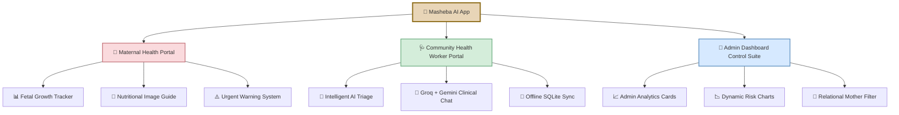

<div align="center">


# MaSheba AI — মাসেবা AI

### *মাতৃস্বাস্থ্য ও পুষ্টি সেবায় কৃত্রিম বুদ্ধিমত্তা*

**A state-of-the-art, offline-first, AI-driven maternal healthcare platform for rural Bangladesh**

[](https://expo.dev)
[](https://www.sqlite.org)
[](https://fastapi.tiangolo.com)
[](https://supabase.com)
[](https://groq.com)
[](https://ai.google.dev)
[](#)
[](https://nextjs.org)
[](LICENSE)

<br />

> *"An AI-powered maternal health app that logs visits locally with zero internet, syncs seamlessly when online, and runs a clinical safety net right on-device — ensuring no mother falls through the cracks."*

<br />

**🏆 Built for The Infinity AI BuildFest 2026 by Team DareDevil**

</div>

---

## 📋 Table of Contents

- [Project Overview](#-project-overview)
- [Core Architecture](#-core-product-architecture)
- [Key Features by Portal](#-key-features-by-portal)
  - [Maternal Health Portal](#-1-maternal-health-portal-গর্ভবতী-মা-পোর্টাল)
  - [Clinical Health Worker Portal](#-2-clinical-health-worker-chw-portal-স্বাস্থ্যকর্মী-পোর্টাল)
  - [Administrative Control Panel](#-3-administrative-control-panel-অ্যাডমিন-ড্যাশবোর্ড)
- [Clinical & Operational Benefits](#-clinical--operational-benefits)
- [Premium Design System](#-premium-design-system)
- [Operational Guide](#-operational-guide-how-to-use-the-app)
- [Project Structure](#-project-structure)
- [Getting Started](#-getting-started)
- [Tech Stack](#-tech-stack)
- [Team](#-team)
- [License](#-license)

---

## 🌍 Project Overview

<div align="center">


</div>

**Bangladesh has one of the highest maternal mortality rates in South Asia.** In rural areas, critical symptoms like preeclampsia are often ignored until it is too late. Community Health Workers (CHWs) — the primary touchpoint for pregnant women — lack real-time clinical decision support, especially in areas with poor connectivity, low-end devices, and frequent power outages.

**Masheba AI (মাতৃস্বাস্থ্য ও পুষ্টি সেবায় কৃত্রিম বুদ্ধিমত্তা)** bridges the gap between rural pregnant mothers, Community Health Workers, and health administrators. Through highly refined user interfaces, dynamic AI risk triaging, and real-time medical query support, Masheba AI ensures that **no pregnancy goes unmonitored**.

### ⚡ What Makes MaSheba Different

| Capability | Description |
|:-----------|:------------|
| 🔌 **Offline-First Architecture** | Core database operations (SQLite + WAL) run locally with zero data loss during power or network cuts |
| 🤖 **Dual LLM Cascade** | Groq (Llama 3.1) → Gemini (Flash 2.5) → Offline fallback — always responds, never blocks |
| 🛡️ **Safety-Filtered AI** | No drug dosages, no diagnoses — always refers to upazila hospitals with emergency protocols |
| 📊 **Real-Time Admin Visibility** | Unified relational dashboard for upazila health officers to audit patient risk distributions |
| 🗣️ **Voice-Ready (Bangla)** | Speech input for semi-literate users when online |
| 🔒 **Privacy by Design** | Row Level Security (RLS) ensures CHWs see only their own patients |

---

## 🌟 Core Product Architecture

Masheba AI features a **Dual-Portal Framework** with an **Administrative Control Panel** integrated seamlessly under the hood:



---

## 🛠️ Key Features by Portal

### 🤰 1. Maternal Health Portal (গর্ভবতী মা পোর্টাল)


Designed with highly readable, **pastel-toned**, and encouraging visual guides for pregnant mothers:

| Feature | Description |
|:--------|:------------|
| 🎡 **Pregnancy Progress Wheel & Fetal Growth Tracker** | A custom circular countdown matching the gestational age in weeks (1–40). Features **dynamic size comparisons** — comparing the baby's size to fruits and vegetables like pomegranate or lentils — making tracking engaging and intuitive for semi-literate users. |
| 🥗 **Nutritional Intake Guide (পুষ্টি নির্দেশিকা)** | Rich, categorized **food galleries with visual guides** showing key food categories — proteins, vitamins, dairy, and water intake — to guide daily diet through imagery rather than text. |
| ⚠️ **Urgent Warnings (শতর্কতা)** | Direct, highlight-alert panels warning mothers about **danger signs** requiring immediate clinical visits: severe swelling, high blood pressure, preeclampsia indicators, and other critical symptoms. |
| 📖 **Offline Medical Q&A** | Locally compiled questions and answers providing trusted advice **even without internet connectivity**. When online, mothers can chat with the live AI assistant using natural language in Bangla. |

---

### 🩺 2. Clinical Health Worker (CHW) Portal (স্বাস্থ্যকর্মী পোর্টাল)


An **offline-first clinical workspace** for active workers in rural communities:

| Feature | Description |
|:--------|:------------|
| 🎯 **Intelligent AI Triage System** | As health workers log clinical data (blood pressure, maternal age, gestational age, weight, symptoms), an automated triage system **evaluates the mother's risk profile instantly** using deterministic safety rules (<200ms, zero network latency). |
| 🚦 **Pastel Glowing Risk Indicators** | Classifies mothers into three tiers using clear, pastel-colored status indicators: |
| | 🔴 **উচ্চ ঝুঁকি (High Risk)** — Prompts immediate critical action or clinical referral |
| | 🟡 **মাঝারি ঝুঁকি (Moderate Risk)** — Alerts the worker to schedule frequent checkups |
| | 🟢 **কম ঝুঁকি (Low Risk)** — Normal pregnancy metrics confirmed |
| 💬 **Groq + Gemini Clinical AI Assistant** | A **hybrid offline/online LLM chat service**. Workers can type medical questions in Bengali or English to receive instant diagnostic guidance. The cascade ensures: Groq (Llama 3.1 8B) → Gemini (Flash 2.5) → structured offline fallback. |
| 🔄 **Offline SQLite Storage & Hot Sync** | Allows health workers to **log visits deep in rural areas without internet**. The application caches data locally using SQLite with WAL journaling (crash-safe) and synchronizes automatically with the cloud database the moment a network connection is detected. |
| 💊 **Medicine Verification** | Drug safety checker specifically tailored for pregnant women — flags contraindicated medications. |
| 🚨 **Emergency Alerts** | Auto-detects critical symptoms and provides immediate referral details with hospital directions. |

---

### 👑 3. Administrative Control Panel (অ্যাডমিন ড্যাশবোর্ড)


An administrative dashboard for **district health officers** to monitor community operations:

| Feature | Description |
|:--------|:------------|
| 🔐 **Invisible Credentials Gateway** | Access is **fully integrated into the standard health worker login form**. By entering the secret credentials (**Username: `admin` / Password: `admin123`**), the app intercepts and redirects instantly to the Admin Dashboard. There are **no visible admin buttons** to clutter the user experience. |
| 📈 **Real-Time Analytics Cards** | Instantly inspect active metrics: **total active workers**, **registered mothers**, and **critical high-risk ratios** displayed in prominent dashboard cards at the top. |
| 📉 **Dynamic Risk Charts** | Recharts-powered stacked bar charts showing **LOW / MODERATE / HIGH** risk patient distribution broken down by individual CHW. |
| 🔍 **Unified Search & Directory Grid** | Interactive tables showing all registered Health Workers and Pregnant Mothers with **real-time filters** for name, union, or upazila — supporting instant search across the entire registry. |
| 📊 **Decluttered High-Flex Tables** | Optimized table column spacing with **zero-line wrapping** on text, specifically tuned for Bengali scripts and multi-word administrative areas like *Narsingdi Sadar*. |
| 🔗 **Relational Patient Filtering** | Officers can **tap any Health Worker's row** to view their detailed metrics and immediately filter the maternal registry to inspect that specific worker's active patients — creating a hierarchical drill-down workflow. |

---

## 📈 Clinical & Operational Benefits

<div align="center">

| 💡 The Problem (Traditional Care) | 🛡️ The Masheba AI Solution | 🚀 Clinical Value |
| :--- | :--- | :--- |
| **High Maternal Mortality**: Critical symptoms like preeclampsia are often ignored until it is too late. | **Instant AI Triaging**: Instant calculations highlight severe warnings immediately. | **Early Detection**: Prevents critical delays in referrals, potentially saving maternal lives. |
| **No Connectivity**: Rural clinics lose access to data due to unstable networks. | **Offline SQLite Cache**: The app functions fully offline, caching data safely with WAL journaling. | **Uninterrupted Care**: Complete continuity of medical history in remote settings. |
| **Medical Guidance Gaps**: Workers need immediate second opinions on complex symptoms. | **Groq + Gemini Assistant**: Workers get structured clinical guidance in their native language. | **Empowered Decisions**: Enhances the medical knowledge and confidence of front-line workers. |
| **Scattered Admin Auditing**: Monitoring rural workers' efficiency is fragmented. | **Unified Relational Admin Dashboard**: Real-time auditing of patient distribution and risk categories. | **Efficient Resource Allocation**: Directs health assets to where high-risk mothers need them most. |

</div>

---

## 🎨 Premium Design System


Masheba AI is crafted with **extreme attention to visual harmony** and premium user experiences:

| 🎨 Element | Implementation |
|:-----------|:---------------|
| **HSL Pastel Palette** | Tailored HSL color models blending soft medical pastel tints — **warm peach**, **healing green**, **soft rose** — with smooth, anti-glare dark cards for extended use without eye strain. |
| **Custom Notch Spacing** | Safe area layouts **custom-tailored to avoid status bars and notches** on both iOS and Android. Pixel-perfect alignment across device generations. |
| **Android Canvas Optimization** | **Circular status indicator dots** instead of bordered shapes to prevent border-line rendering artifacts on Android's hardware-accelerated drawing canvas. |
| **Bengali-First Typography** | Clean **Outfit/Inter** sans-serif pairings alongside carefully scaled Bengali fonts — ensuring accessibility and readability for semi-literate users across all screen sizes. |
| **Pastel Risk Indicators** | Glowing, high-contrast risk dots using three-tier soft colors — immediately recognizable without reading text labels. |

---

## 📖 Operational Guide: How to Use the App

### 🤰 For Pregnant Mothers
1. **Welcome & Setup**: Tap **"গর্ভবতী মা হিসেবে চালিয়ে যান"** (Continue as Pregnant Mother) on the landing page.
2. **Home Feed**: Check the center pregnancy wheel showing your current week, days remaining, and an animation of your baby's current size.
3. **Explore Nutrition**: Navigate using the bottom tabs to the **"পুষ্টি"** (Nutrition) section. Browse food categories and adjust your daily diet.
4. **View Warnings**: Visit the **"শতর্কতা"** (Warnings) page to learn about critical preeclampsia symptoms and high-risk indicators.

### 🩺 For Community Health Workers (CHWs)
1. **Clinical Login**: Tap **"স্বাস্থ্যকর্মী হিসেবে চালিয়ে যান"** (Continue as Health Worker) and log in with your worker ID.
2. **Mother Directory**: View your registered patient lists, risk categories, and schedule pending visits.
3. **Triage Assessment**: Conduct a checkup, enter vital signs (systolic/diastolic pressure, gestational age, symptoms), and let the system calculate the maternal risk status.
4. **Consult AI**: Access the **"ক্লিনিক্যাল চ্যাট"** (Clinical Chat) to consult the AI assistant on complex symptoms.

### 👑 For Administrators
1. **Secret Access**: Tap **"স্বাস্থ্যকর্মী হিসেবে চালিয়ে যান"** (Continue as Health Worker).
2. **Enter Credentials**: Enter `admin` in the email input and `admin123` in the password input.
3. **Command Dashboard**: Instantly inspect the real-time active metrics cards at the top showing total active workers, registered mothers, and critical high-risk ratios.
4. **Directory Auditing**: Use the search bar to locate workers in specific unions, tap their profile to view performance, and audit patients directly.

---

## 📁 Project Structure

```
Masheba--AI/
│
├── mobile/                          # 📱 React Native (Expo) mobile app
│   ├── app/                         #    Expo Router screens
│   ├── src/
│   │   ├── api/                     #    API client (sync, chat)
│   │   ├── auth/                    #    Secure session management
│   │   ├── components/              #    Reusable UI components
│   │   │   ├── chat/                #      Chat bubbles, input
│   │   │   ├── emergency/           #      Emergency banners
│   │   │   ├── form/                #      Visit form fields
│   │   │   ├── navigation/          #      Tab & stack navigators
│   │   │   ├── nutrition/           #      Nutrition guidance cards
│   │   │   ├── patient/             #      Patient list & detail
│   │   │   ├── risk/                #      Risk badge, indicators
│   │   │   └── sync/                #      Sync status indicators
│   │   ├── context/                 #    React context providers
│   │   ├── data/                    #    Offline Q&A seed (Bangla)
│   │   ├── db/                      #    SQLite schema, outbox, CRUD
│   │   ├── features/
│   │   │   ├── mother/              #      Mother dashboard
│   │   │   └── qa/                  #      Offline Q&A chat
│   │   ├── model/                   #    Local risk scoring & mock inference
│   │   ├── notifications/           #    Push notification handlers
│   │   ├── screens/chw/             #    CHW-facing screens
│   │   ├── sync/                    #    Background sync worker
│   │   ├── theme/                   #    Design tokens & styling
│   │   ├── types/                   #    TypeScript type definitions
│   │   └── utils/                   #    Shared utilities
│   ├── assets/                      #    Fonts, images
│   ├── __tests__/                   #    Jest test suites
│   ├── app.json                     #    Expo configuration
│   └── package.json
│
├── backend/                         # ⚙️ FastAPI Python backend
│   ├── app/
│   │   ├── core/config.py           #    Environment & settings
│   │   ├── models/                  #    Pydantic request/response schemas
│   │   ├── routers/
│   │   │   ├── health.py            #    GET /health
│   │   │   ├── sync.py              #    POST /sync (outbox batch)
│   │   │   └── chat.py              #    POST /chat (AI assistant)
│   │   ├── services/
│   │   │   ├── chat_service.py      #    LLM cascade (Groq → Gemini)
│   │   │   └── supabase_client.py   #    Supabase RPC & auth
│   │   └── main.py                  #    FastAPI app entrypoint
│   ├── tests/                       #    pytest test suites
│   └── requirements.txt
│
├── admin/                           # 📊 Next.js 14 admin dashboard
│   ├── app/
│   │   ├── dashboard/               #    Dashboard page (SSR)
│   │   ├── docs/                    #    Embedded documentation portal
│   │   │   ├── page.tsx             #      Product handbook viewer
│   │   │   ├── DocsView.tsx         #      Rendered docs content
│   │   │   └── admin/               #      Admin-specific docs
│   │   ├── layout.tsx               #    Root layout
│   │   ├── page.tsx                 #    Root page
│   │   └── globals.css
│   ├── components/
│   │   ├── RiskSummaryChart.tsx      #    Recharts bar chart
│   │   └── Mermaid.tsx              #    Mermaid diagram renderer
│   ├── utils/                       #    Supabase server client
│   └── package.json
│
├── model/                           # 🧠 ML risk classifier pipeline
│   ├── config/
│   │   ├── feature_schema.json      #    Feature schemas
│   │   └── risk_thresholds.json     #    Clinical threshold config
│   ├── scripts/
│   │   ├── profile_sources.py       #    Dataset profiling
│   │   ├── prepare_dataset.py       #    Feature engineering
│   │   ├── train_xgboost.py         #    XGBoost training
│   │   ├── export_onnx.py           #    ONNX export
│   │   ├── validate_model.py        #    WHO threshold validation
│   │   └── benchmark_onnx.py        #    Inference benchmarking
│   ├── artifacts/                   #    Trained model files
│   └── pyproject.toml
│
├── supabase/                        # 🗄️ Supabase infrastructure
│   ├── migrations/                  #    Postgres migration SQL files
│   ├── functions/
│   │   └── sync-outbox/             #    Deno edge function
│   ├── seed/                        #    Demo data for testing
│   └── tests/                       #    Stress test & RLS verification
│
├── docs/                            # 📄 Technical documentation
│   ├── API.md                       #    REST API reference
│   ├── SCHEMA.md                    #    Database schema docs
│   ├── SETUP.md                     #    Dev environment setup
│   └── SYNC_RUNBOOK.md              #    Sync verification playbook
│
├── ICON.png                         #    Masheba AI logo
├── ARCHITECTURE.md                  #    Detailed architecture document
├── Masheba_comprehensive_handbook.md.resolved
├── .env.example                     #    Environment variable template
└── .gitignore
```

---

## 🚀 Getting Started

### Prerequisites

| Tool | Version | Purpose |
|:-----|:--------|:--------|
| Node.js | ≥ 18 | Mobile + Admin |
| Python | ≥ 3.11 | Backend + ML pipeline |
| Expo CLI | Latest | Mobile development |
| Supabase CLI | Latest | Database migrations |
| Android device/emulator | API 26+ (Android 8) | Mobile testing |

### 1. Clone the Repository

```bash
git clone https://github.com/DigontaDas/MaSheba--AI.git
cd MaSheba--AI
```

### 2. Environment Setup

```bash
cp .env.example .env
# Fill in your Supabase, Groq, and Gemini API keys
```

### 3. Backend Setup

```bash
cd backend
python -m venv .venv

# Windows
.\.venv\Scripts\Activate.ps1

# macOS / Linux
source .venv/bin/activate

pip install -r requirements.txt
pytest                                    # Run tests
uvicorn app.main:app --reload             # Start server at :8000
```

### 4. Mobile App Setup

```bash
cd mobile
npm install
npx expo start                            # Start Expo dev server
# Press 'a' for Android emulator
# Scan QR code with Expo Go on physical device
```

### 5. Admin Dashboard Setup

```bash
cd admin
npm install
npm run dev                               # Start at :3000
```

### 6. Database Setup

```bash
supabase db push                          # Apply migrations
supabase functions deploy sync-outbox     # Deploy edge function
```

---

## ⚙️ Tech Stack

<div align="center">

| Layer | Technology | Purpose |
|:------|:-----------|:--------|
| **📱 Mobile** | React Native (Expo) | Cross-platform mobile app |
| **💾 Local DB** | SQLite + WAL Mode | Crash-safe offline storage |
| **🔄 Sync** | Outbox Pattern + Background Worker | Idempotent 2-min polling sync |
| **⚙️ Backend** | FastAPI (Python 3.11+) | REST API + AI orchestration |
| **☁️ Cloud DB** | Supabase (PostgreSQL 15) | RLS-scoped cloud storage |
| **🤖 Primary LLM** | Groq (Llama 3.1 8B Instant) | Fast Bangla clinical chat |
| **🤖 Fallback LLM** | Google Gemini (Flash 2.5) | Secondary AI cascade |
| **🛡️ Safety** | Deterministic Rules | <200ms on-device risk scoring |
| **📊 Admin** | Next.js 14 (Vercel) | SSR admin dashboard |
| **📈 Charts** | Recharts | Risk distribution visualization |
| **🔐 Auth** | Supabase Auth + expo-secure-store | JWT-based session management |

</div>

---

## 👥 Team

<div align="center">

### Team DareDevil

| Role | Name |
|:-----|:-----|
| 🎨 **UI/UX Design** | Mihir Das |
| ⚙️ **Backend Engineering** | Mehedi Hasan Nafis |
| 📊 **Business Analytics / Data Science** | Fayaz Bin Faruk |
| 🎤 **Presentation / Communication** | Hasnain Ashraf |
| 🗂️ **Project Manager** | Digonta Das |

</div>

---

## 📄 License

This project is licensed under the MIT License — see the [LICENSE](LICENSE) file for details.

---

<div align="center">


### 🇧🇩 Built with ❤️ for Bangladesh's mothers

*মাষেবা (Masheba) — "Service to Mother"*

**Every mother deserves a safety net. Masheba AI ensures no one falls through.**

<br />

[](https://github.com/DigontaDas/MaSheba--AI)
[](https://github.com/DigontaDas/MaSheba--AI/fork)

*Masheba AI is changing the landscape of community-based maternal care, keeping mothers safe and empowering the workers who care for them.*

</div>
